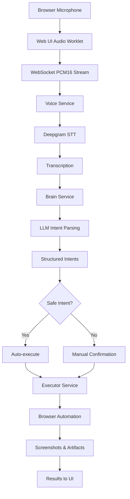

# Voice Web Agent

A voice-controlled browser automation system that converts speech to structured intents and executes them in real browsers. Speak naturally to navigate websites, perform searches, extract data, and automate web tasks.

## Architecture

```
Voice Input → Deepgram STT → LLM Intent Parsing → Browser Automation
     ↓              ↓                ↓                    ↓
  Web UI    →  Voice Service  →  Brain Service  →  Executor Service
```

### Components

- **`apps/brain`** - FastAPI service for LLM-powered intent parsing
- **`apps/executor`** - Playwright browser automation with Browserbase support  
- **`apps/voice`** - WebSocket server handling Deepgram transcription and orchestration
- **`apps/web`** - React UI for voice capture and execution monitoring
- **`packages/schemas`** - Shared TypeScript schemas and validation

## Features

- **Real-time Speech Transcription** - Powered by Deepgram's Nova-3 model
- **Natural Language Intent Parsing** - Uses OpenAI/compatible LLMs to convert speech to browser actions
- **Universal Browser Automation** - Works across websites with robust selector strategies
- **Safety Controls** - Automatic execution for safe actions, manual confirmation for risky operations
- **Remote & Local Execution** - Supports both Browserbase cloud browsers and local Chrome
- **Session Management** - Persistent browser sessions across multiple voice commands
- **Rich Artifacts** - Screenshots, data extraction, and execution logs

## Quick Start

### Prerequisites

- Node.js 18+ and pnpm
- Python 3.11+ (for brain service alternative)
- API keys for:
  - OpenAI or compatible LLM service
  - Deepgram
  - Browserbase (optional, for remote browsers)

### Installation

```bash
# Clone and install dependencies
git clone <repository-url>
cd voice-web-agent
pnpm install
pnpm -r build
```

### Environment Setup

Create a `.env` file in the project root:

```bash
# LLM Configuration (Brain Service)
LLM_API_KEY=your_openai_api_key
LLM_BASE_URL=https://api.openai.com
LLM_MODEL=gpt-4o-mini

# Deepgram Speech Recognition
DEEPGRAM_API_KEY=your_deepgram_api_key
DEEPGRAM_MODEL=nova-3

# Browserbase (Optional - for remote browsers)
BROWSERBASE_API_KEY=your_browserbase_api_key
BROWSERBASE_PROJECT_ID=your_project_id

# Service Ports
BRAIN_PORT=8090
VOICE_PORT=7072
EXECUTOR_PORT=7081

# Executor Configuration
EXECUTOR_HEADLESS=false  # Set to true for headless browsers
EXECUTOR_URL=http://127.0.0.1:7081
BRAIN_URL=http://127.0.0.1:8090/parse
```

### Running the System

Start all services in separate terminals:

```bash
# Terminal 1: Brain Service (Intent Parsing)
cd apps/brain && pnpm dev

# Terminal 2: Voice Service (Speech + Orchestration)  
cd apps/voice && pnpm dev

# Terminal 3: Executor Service (Browser Automation)
cd apps/executor && pnpm dev

# Terminal 4: Web UI
cd apps/web && pnpm dev
```

Open http://localhost:5173 in your browser.

## Usage

### Voice Commands

Click "Start" in the web UI and speak naturally:

**Navigation & Search:**
- "Go to Google and search for wireless headphones"
- "Navigate to Amazon and find laptops under 500 dollars"
- "Visit GitHub and search for react components"

**Data Extraction:**
- "Extract the top 5 search results with prices"
- "Get the product details from this page"
- "Take a screenshot of the current page"

**Navigation:**
- "Go back to the previous page"
- "Scroll down to see more results"
- "Click on the second result"

### Intent System

The system converts speech into structured intents:

```json
{
  "type": "navigate",
  "args": { "url": "https://www.google.com" },
  "requires_confirmation": false,
  "priority": 0
}
```

**Supported Intent Types:**
- `navigate` - Go to URLs
- `search` - Universal search across websites
- `click` - Click elements by selector, text, or role
- `type` - Fill form inputs
- `extract_table` - Extract structured data
- `filter` - Apply filters (price, category, etc.)
- `sort` - Sort results by criteria
- `upload` - File uploads with confirmation
- `screenshot` - Capture page images
- `scroll`, `back`, `forward` - Navigation actions

### Safety Features

**Automatic Execution**: Safe actions execute immediately
- Navigation, search, scrolling, data extraction

**Manual Confirmation**: Risky actions require approval
- File uploads, form submissions, payments, login attempts

The web UI shows intent plans before execution with confirmation prompts for risky operations.

## Development

### Project Structure

```
voice-web-agent/
├── apps/
│   ├── brain/          # Intent parsing service
│   │   ├── src/
│   │   │   ├── llm.ts        # OpenAI client
│   │   │   ├── schema.ts     # Intent schemas  
│   │   │   └── server.ts     # FastAPI server
│   │   └── test/
│   ├── executor/       # Browser automation
│   │   ├── src/
│   │   │   ├── actions.ts    # Intent execution
│   │   │   ├── session.ts    # Browser management
│   │   │   └── server.ts     # Executor API
│   │   └── .artifacts/       # Screenshots & data
│   ├── voice/          # Speech & orchestration
│   │   ├── src/
│   │   │   ├── deepgram.ts   # Speech recognition
│   │   │   └── server.ts     # WebSocket server
│   │   └── test/
│   └── web/            # React frontend
│       ├── src/
│       │   ├── App.tsx       # Main interface
│       │   └── components/   # UI components
│       └── public/
├── packages/
│   └── schemas/        # Shared types
└── .env                # Configuration
```

### Adding New Intent Types

1. **Define the intent** in `packages/schemas/src/index.ts`
2. **Add LLM examples** in `apps/brain/src/server.ts` FEWSHOTS
3. **Implement execution** in `apps/executor/src/actions.ts`
4. **Test end-to-end** with voice commands

### Testing

```bash
# Run all tests
pnpm -r test

# Test specific services
cd apps/brain && pnpm test
cd apps/executor && pnpm test
cd apps/voice && pnpm test
```

## Configuration

### LLM Providers

The brain service supports any OpenAI-compatible API:

```bash
# OpenAI
LLM_BASE_URL=https://api.openai.com
LLM_MODEL=gpt-4o-mini

# Anthropic (via proxy)
LLM_BASE_URL=https://api.anthropic.com
LLM_MODEL=claude-3-sonnet-20240229

# Local models (Ollama, etc.)
LLM_BASE_URL=http://localhost:11434/v1
LLM_MODEL=llama2
```

### Browser Execution

**Browserbase (Recommended for Production):**
- Remote browsers in the cloud
- Better reliability and scaling
- Requires API key and project ID

**Local Chrome:**
- Runs on your machine
- Good for development
- Set `BROWSERBASE_API_KEY` to empty to use local mode

### Voice Recognition

Deepgram configuration options:

```bash
DEEPGRAM_MODEL=nova-3        # Latest model
DEEPGRAM_LANGUAGE=en-US      # Language code
```

## Troubleshooting

### Common Issues

**"No DEEPGRAM_API_KEY set"**
- Add your Deepgram API key to `.env`
- Restart the voice service

**"LLM_API_KEY not set"**  
- Add your OpenAI/LLM API key to `.env`
- Restart the brain service

**Browser doesn't open**
- Check executor service logs
- Verify Browserbase credentials or local Chrome installation
- Ensure executor port 7081 is accessible

**Search not working**
- Check executor logs for selector matching
- Some sites may have updated their HTML structure
- The universal search should handle most cases

**Session becomes invalid**
- Happens when browser is manually closed
- Next command will automatically create a new session
- Check session management logs in executor

### Debug Mode

Enable detailed logging:

```bash
# Add to .env
DEBUG=true
EXECUTOR_HEADLESS=false  # See browser actions
```

### Port Conflicts

If default ports are in use, modify `.env`:

```bash
BRAIN_PORT=8091
VOICE_PORT=7073  
EXECUTOR_PORT=7082
```

Update service URLs accordingly in voice server configuration.

## Architecture Details

### Flow Diagram



### Data Flow

1. **Audio Capture**: Web Audio API captures microphone at device sample rate
2. **Audio Processing**: Resampled to 16kHz PCM16 mono for Deepgram
3. **Speech Recognition**: Real-time transcription with interim/final results  
4. **Intent Parsing**: LLM converts natural language to structured intents
5. **Safety Analysis**: Intents classified as safe (auto-execute) or risky (confirm)
6. **Browser Automation**: Playwright executes intents in Chrome/Browserbase
7. **Artifact Generation**: Screenshots, data extracts, execution logs
8. **User Feedback**: Real-time updates and results displayed in UI

### Security Considerations

- **API Key Management**: Store sensitive keys in `.env`, never commit to version control
- **Intent Validation**: All intents validated against Zod schemas before execution  
- **Confirmation Gates**: Risky operations require explicit user approval
- **Sandbox Execution**: Browser automation runs in isolated contexts
- **Data Privacy**: Voice data processed in real-time, not stored permanently

## Contributing

### Development Workflow

1. Fork the repository
2. Create a feature branch
3. Make changes with tests
4. Run full test suite: `pnpm -r test`
5. Update documentation
6. Submit pull request

### Code Style

- TypeScript for all services
- ESLint/Prettier for formatting
- Zod for schema validation
- Vitest for testing

### Adding Features

When adding new functionality:

1. **Update schemas** first in `packages/schemas`
2. **Add LLM training examples** in brain service
3. **Implement execution logic** in executor service  
4. **Add comprehensive tests**
5. **Update documentation**

## License

MIT License - see LICENSE file for details.

## Support

- **Issues**: GitHub Issues for bug reports and feature requests
- **Discussions**: GitHub Discussions for questions and community support
- **Documentation**: See `/docs` folder for detailed guides